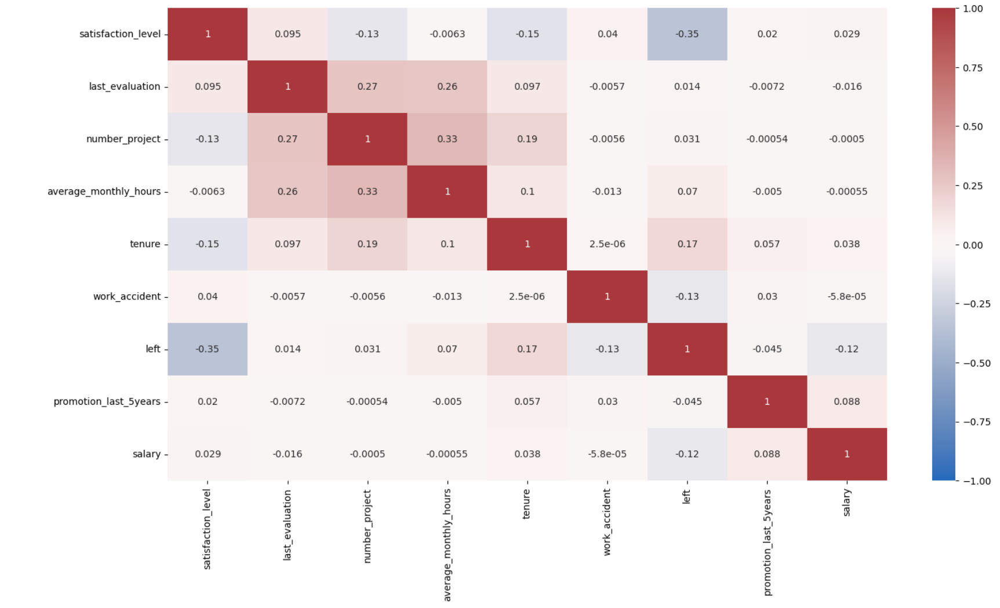

# Salifor Motors员工留存率分析
项目背景： Salifort Motors是一家虚构的能源汽车制造商，其全球员工超过100000名。该公司的人力资源部门想采取一些措施提高员工的留存率，相比起寻找和雇佣新员工的成本和风险， 尽可能保存现有运营结构杯认为是更合理的方式。

因此本项目收集了14999名员工信息作为样本，将进行数据分析的全部过程并提供数据驱动的建议。由于本项目关注提高员工的留存率，因此需要挖掘员工离职的相关因素，并构建合适 的模型预测员工离职的可能性。

数据指标简介：

satisfaction_level：员工报告的工作满意度

last_evaluation： 员工当前最后一次记录的绩效考核得分

number_project： 员工参与的项目总数

average_monthly_hours： 员工每月平均工作时长

time_spend_company： 员工在公司工作的年份

Work_accident： 是否在公司发生事故

left： 是否离职

promotion_last_5years： 员工在过去5年是否得到晋升

Department： 所在部门

salary： 工资

## 数据分析概况

'
左图显示项目完成更多的员工平均工作时间也更长，符合自然情况。

然而右图的信息显示离职员工集群分别集中在低项目完成数低工时，与高项目完成数高工时中。

根据此趋势可以初步推断低工时群体很可能是业绩不足被解雇，而高工时则是过度工作不堪重负辞职。

此外，完成项目在3-4的区间中员工离职率最低，可以作为员工项目完成参考的最佳标准。

经计算，以8小时工作制为标准，每年工作50周为标准计算出每年平均工时标准为166.67小时。

上图显示离职人主要集中在三个区域，其中低满意度高工时的群体最低工时都接近250小时，远远超出了平均工时标准，显然这部分员工不堪重负同时也可以想象他们获得的待遇与付出可能并不匹配。

中满意度低工时群体显然属于被解雇人群。

而高满意度高工时群体存在点合成的可能性，并不清晰，暂时无法轻易下推断。

'
可见离职人群体集中在中低工资却高工时的区域中，印证了上图离职高工时员工没有获得应得待遇的推论。

'
该阶段将离职人划分为低工龄中低满意度和中等工龄较高满意度。

低工龄群体结合前文显然与被辞退群体重合，而中等工龄群体缺乏更具体信息难以判断属性，可初步推断为在公司内得到成长的跳槽高业绩员工。

此外，4年工龄离职的群体评价尤为低下，可以挖掘该年份的公司政策是否发生改变。

'
上图可得知低工龄员工以中低薪为主，这符合一般市场情况，但长期任职的员工中高薪也占比较低，可以推断为管理层岗位。

'
很显然，离职者在过去5年里绝大多数都未能获得晋升，而他们同时也是工时最长的员工，结合前文高工时往往完成了高项目数和业绩的情况，公司的晋升机制可能存在相当大的问题，最出色的员工都没能留下。

相反，成功得到晋升的员工离职的比例很低，这似乎揭示了一种激励方式。

'
根据主要变量完成热力图观察变量间的相关性，其中项目评分，完成项目数和月平均工时之间存在较明显关联。

## 数据建模概况
由于预测员工的留存与否为二元划分问题，因此本项目采用随机森林模型兼顾效率和效果进行预测。

为了验证变量相关性与最大化模型效率，本项目通过2次构建随机森林模型保留最大影响变量。

'

经过两次拟合，虽然模型结果显示整体分数出现下降，但作为决定性指标的auc没有出现明显波动，依然表现足够出色。

'

0.9478的auc预测得分代表着该模型有94.78的概率正确预测员工的离职与否。

'
True positive: 预测留下且实际留下 False positive：预测留下却实际离开 False negative：预测离开却实际留下 True negative: 预测离开且实际离开

TN多于FP，即有一些员工存在被解雇的风险

'
在两次拟合与验证模型后，图表显示在此随机森林模型中number_project, last_avaluation, tenure, overworked重要性依次最高。它们对预测结果变量最有帮助，而其他的特征造成的影响微乎其微。

总结：

可视化分析与模型证明了该公司整体存在员工过度工作的问题，为了提高留存率，本项目研究建议公司可从开源和节流两个方向入手：

节流

1. 控制员工的项目完成数，调整业绩指标，完成4个项目即可获得公司当月度奖金上限，使公司的工时与工资分配更加平均化，减小员工间的不平衡；

2. 设立加班时间上限，超过上限的工时减少加班工资，降低员工加班的积极性同时节省开支；

开源

1. 月度记录员工的工时和业绩情况，使员工的贡献可视化与透明化，并且为最高贡献的员工提供合理的晋升机会；

2. 重新设计奖金与薪酬制度，为高贡献员工提供更合理的薪资结构；

3. 进一步探索工龄为4年的员工离职原因，这一时间作为新老员工的评价分界点很大概率产生了重大政策变故；
